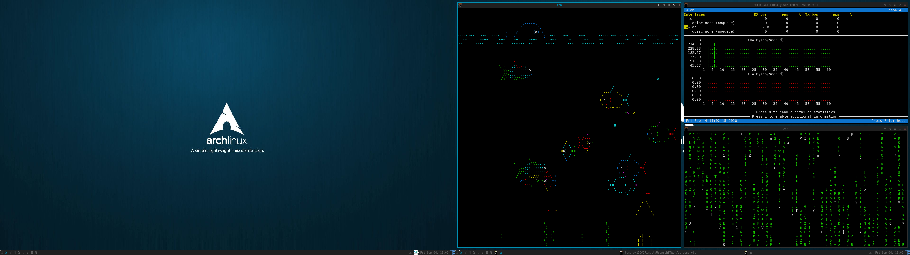

# archKiss for AwesomeWM 4.3-2 or 4.X

Making this fork was probably a mistake, because at the time I didn't know much about Github and I had just joined, but I'll try to make the best of it.

*Please change the home folder in theme.lua and theme_default.lua to your home folder. The wallpaper path is ~/.wallpaper, so you will have to either change it or put a file there.*

## Screenshot

## Dependencies
### Finally, I decided to list all the modules that this repo uses to work fully right here, so your job is easier. Note that not all these are completely necessary, and many of them are just apps that I bound to a key combo.
* st - Default terminal
* firefox - Default browser
* nvim - Default text editor
* batterymon-clone (AUR) - System tray applet
* pasystray - System tray applet
* scrot - To take screenshots with the Print key
* slock - To lock the screen using Super+Esc
### Apps I use that were bounded to a key in rc.lua:
* discord - Discord messenger (Pretty trash but all my friends use it so I had to, I'm sorry)
* lutris - Lutris game manager
* veracrypt - I need this to manage my encrypted external hard drive
* keepassxc - I use this as my personal password manager
* I use Tor Browser and have a keybind to open it, however, I have to use a workaround by creating a script in $PATH called "launch_tor" that starts Tor for me with Super+Shift+e, so if you use this, you will have to create the same script.
* leafpad - GUI text editor used as a pastebin along with Tor browser

## Workarounds
* If you want to use Tor Browser, create a script called $PATH/launch_tor, that starts Tor Browser. I have trouble launching the .desktop file directly.
* You may have to create the directory called ~/screenshots yourself, because when I configure rc.lua to do that automatically, it breaks.
Any fixes in the form of pull requests are welcome.

## Credits
* Github - lgaggini: the original theme
* Taglists squares: dust awesome theme by tdy
* Layout icons: grey-new awesome theme by Andreas Persson (greyscale, grey) ---- Lonefox256 for the cornernw, cornerne, cornersw, cornerse icons.
* Wallpaper used in screenshot:
	[https://www.gnome-look.org/p/1319236](https://www.gnome-look.org/p/1319236)
	Author: Charlie Henson - https://www.pling.com/u/charlie-henson/
	License: (none that I managed to find)
