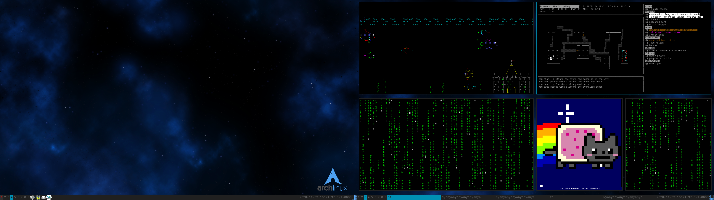

# archKiss for AwesomeWM 4.3-2 or 4.X

Making this fork was probably a mistake, because at the time I didn't know much about Github and I had just joined, but I'll try to make the best of it.
The latest commit is just a quick update because I haven't updated this in a while, and I have new changes and fixes, mostly from the rc.lua file.

## Screenshot

## Dependencies
### Finally, I decided to list all the modules that this repo uses to work fully right here, so your job is easier. Note that not all these are completely necessary, and many of them are just apps that I bound to a key combo.
* st - Default terminal
* firefox - Default browser
* brave - Second browser (I have multiple)
* neomutt - Default email client
* nvim - Default text editor
* scrot - To take screenshots with the Print key
* slock - To lock the screen using Super+Esc
### Apps I use that were bounded to a key in rc.lua:
* jami-gnome - Bound to modkey+D
* signal-desktop - Bound to modkey+Shift+D
* lutris - Bound to modkey+G
* veracrypt - Bound to modkey+Q
* keepassxc - Bound to modkey+W
* gimp - Bound to modkey+V
* leafpad - People tell me that when I'm using Tor Browser, I should only type text into a separate window and paste it into the browser to avoid fingerprinting, so I use this editor instead of nvim because it works better for that purpose.

## Scripts
The rc.lua makes references to many scripts, as I have decided that scripts that I use (including launch\_tor), will be included with this repository. This makes the configs easier to implement and more extensible. Just make sure you update the location that rc.lua looks for scripts after downloading.
* launch\_tor - Starts the Tor Browser, using a script, because I have had difficulty getting it to run with a single command.
* multiabove,multioff,multioff2,multiright - These are what I use to manage my multihead setup. I have the keybinds commented out in the rc.lua itself, but if you are going to use these, make sure you change eDP-1 and HDMI-1 to something else depending on what you get from running xrandr, or change the commands entirely if you don't use xrandr.
* weather - A small script that displays information from the wttr.in service. I used to have this coupled with a doppler radar script until that service got discontinued.

Please fork or pull request if you have a way to not excessively use awful.spawn for every keybind that isn't there by default.

## Credits
* Github - lgaggini: the original theme
* Taglists squares: dust awesome theme by tdy
* Layout icons: grey-new awesome theme by Andreas Persson (greyscale, grey) ---- Lonefox256 for the cornernw, cornerne, cornersw, cornerse icons.
* Wallpaper used in screenshot:
	[https://www.gnome-look.org/p/1319236](https://www.gnome-look.org/p/1319236)
	Author: Charlie Henson - https://www.pling.com/u/charlie-henson/
	License: Creative Commons Attribution
* Widget icons: sunjack awesome theme by ?
* Titlebar icons: zenburn awesome theme by Adrian C. (anrxc)
